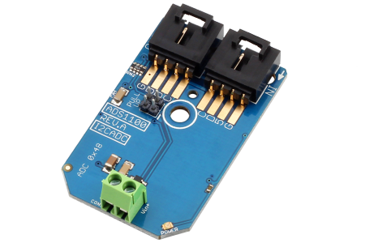

[](https://www.controleverything.com/content/Analog-Digital-Converters?sku=ADS1100_I2CADC)
# ADS1100
ADS1100 Analog to Digital Converter.

The ADS1100 is a 1-Channel Analog to Digital Converter.

This Device is available from ControlEverything.com [SKU: ADS1100_I2CADC]

https://www.controleverything.com/content/Analog-Digital-Converters?sku=ADS1100_I2CADC

This Sample code can be used with Raspberry pi, Arduino and Particle.

## Java
Download and install pi4j library on Raspberry pi. Steps to install pi4j are provided at:

http://pi4j.com/install.html

Download (or git pull) the code in pi.

Compile the java program.
```cpp
$> pi4j ADS1100.java
```

Run the java program.
```cpp
$> pi4j ADS1100
```

## Python
Download and install smbus library on Raspberry pi. Steps to install smbus are provided at:

https://pypi.python.org/pypi/smbus-cffi/0.5.1

Download (or git pull) the code in pi. Run the program.

```cpp
$> python ADS1100.py
```

## Arduino
Download and install Arduino Software (IDE) on your machine. Steps to install Arduino are provided at:

https://www.arduino.cc/en/Main/Software

Download (or git pull) the code and double click the file to run the program.

Compile and upload the code on Arduino IDE and see the output on Serial Monitor.

#####The code output is digital value of an analog input.
